<div align="center">


# KubeStacks

**A beautiful, fast Kubernetes app for the desktop.**

See what's healthy, what's struggling and where your capacity goes across every cluster in your kubeconfig, and fix things safely when they need it.

[](https://github.com/kotapeter/kubestacks/actions/workflows/ci.yml)
[](#testing)
[](LICENSE)

macOS · Windows · Linux

</div>

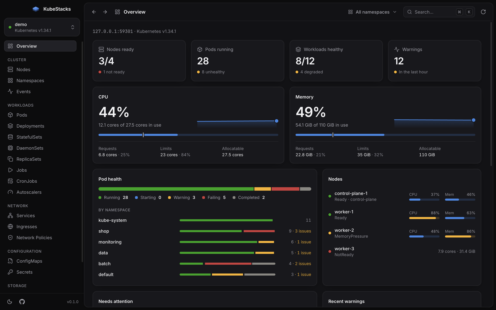

## Why KubeStacks

Most Kubernetes dashboards are either a terminal or a wall of tables. KubeStacks is a calm,
focused desktop app for clusters: it surfaces problems first, shows live resource usage next
to what's allocatable, and gets out of your way. When something needs a hand — a scale, a
restart, a rollback, a drain — it's a click or a keystroke away, with guard rails.

- **Health at a glance.** Every object gets a clear status (Running, CrashLoopBackOff,
  Degraded, NotReady, Pending…), and problems sort to the top. The overview lists what
  needs attention and the most recent warnings.
- **Resource consumption.** Live CPU and memory from metrics-server against allocatable
  capacity, with requests and limits, per-node meters, usage trends and the busiest pods.
- **Every common kind.** Workloads of every kind in one list, with what each runs and
  uses, and nodes, namespaces, events, pods, deployments, stateful sets, daemon sets,
  replica sets, jobs, cron jobs, autoscalers, services, ingresses, network policies,
  config maps, secrets, volume claims, volumes and storage classes.
- **And every other kind.** Custom resources and the rest of the API, found through
  discovery: browsed by API group, with the columns `kubectl get` shows, a
  status read from their conditions, and fields explained by their schema. Views for
  cert-manager, Argo CD and Rollouts, Flux, Gateway API, Karpenter, KEDA, External Secrets,
  the Prometheus operator, CloudNativePG, Istio, Velero and Crossplane add the columns,
  links and actions (sync, reconcile, suspend, promote…) that matter for each, and you can
  write your own.
- **Helm releases.** Every release in the cluster, read from where Helm keeps them (no helm
  needed to look): its status, chart, values with and without the chart's defaults, what it
  made and how that's doing, its notes, and every revision with a diff between any two.
  Upgrade with new values (reviewed as a server-side dry run first), roll back, uninstall,
  or install a chart found on Artifact Hub, all with your own helm.
- **Detail without digging.** A side panel with the facts that matter per kind, container
  state and restarts, conditions, labels, related pods, events, logs and syntax-highlighted
  YAML. Secret values stay hidden until you reveal them.
- **Safe changes.** Scale, restart, roll back, change images, pause rollouts, run CronJobs,
  cordon and drain nodes, evict and delete, edit labels or any object's YAML. Every change
  shows the equivalent `kubectl` command, checks your permissions first, and can be undone
  from its notification where that makes sense.
- **Logs as they're written.** A pod's logs, or every pod's of a workload or service merged
  in the order they were written, each line marked with its pod; pods that start later
  join in. Search, keep only errors or warnings, leave pods out, see the colors apps print,
  start from the last lines or a time, read a crashed container's previous run, and copy or
  download what you see.
- **Hands-on when you need it.** Open a shell in any container, add a debug container with
  tools to a running pod (even distroless ones), and forward ports to pods and services.
- **Usage over time.** KubeStacks finds your Prometheus or VictoriaMetrics and charts what
  the cluster uses, from the last 15 minutes to the last week: a **Metrics** page that ranks
  and compares namespaces, workloads, pods and nodes, with a distribution you can filter by,
  and a **Metrics** tab on pods, workloads and nodes that sets usage against requests,
  limits and capacity. Drag across any chart to zoom in.
- **Many at once.** Pick rows (Shift-click for a range) to restart, cordon, suspend or
  delete them together, with progress per object and a retry for any that fail. Create
  objects from YAML, from a template or pasted, several at a time.
- **Built for big clusters.** Lists load in chunks of 500 and are paginated and virtualized,
  so thousands of pods stay smooth. Busy lists refresh less often, and a label selector
  narrows a list on the server.
- **Keyboard first.** Every view is a shortcut away, lists work with the arrow keys, and
  `⌘K` / `Ctrl+K` jumps to any view, object, namespace or cluster. Navigation animates
  smoothly (and doesn't, if you've turned motion off).
- **Calm when things go wrong.** A lost connection shows a banner and keeps the last data on
  screen; an unexpected error shows what happened, with details to copy or report, instead
  of a blank window.
- **Works with your kubeconfig.** Multiple files via `KUBECONFIG`, kubectl's merge rules,
  client certificates, tokens and exec credential plugins (`gke-gcloud-auth-plugin`,
  `aws eks get-token`, `kubelogin`…), including when launched from the Dock.
- **Light and dark.** Follows your system, or pick one. Native window controls match.

|                                                                    |                                                                            |
| ------------------------------------------------------------------ | -------------------------------------------------------------------------- |
| 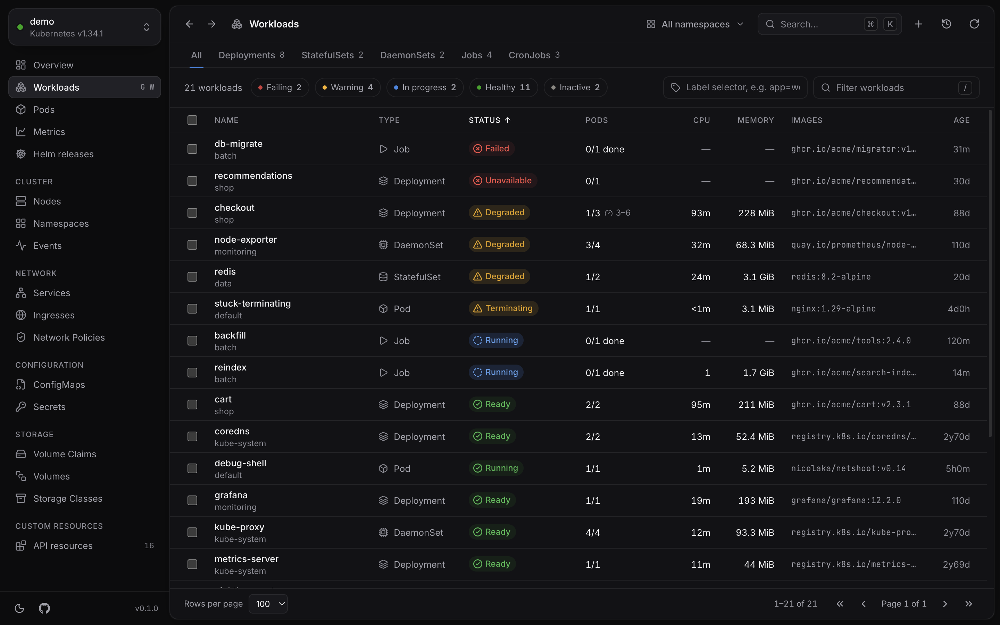 | 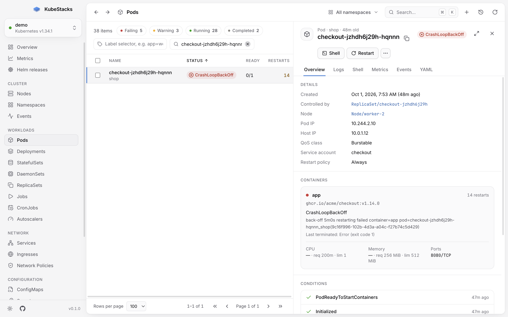                             |
| 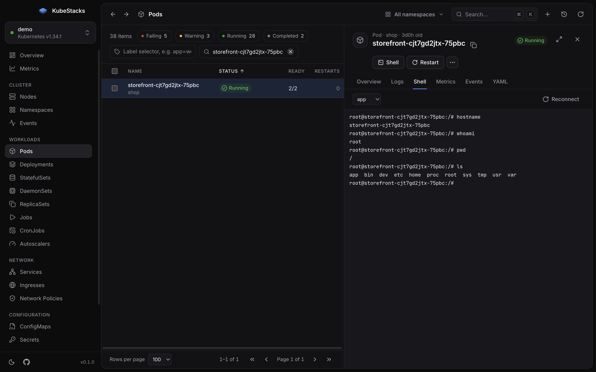               | 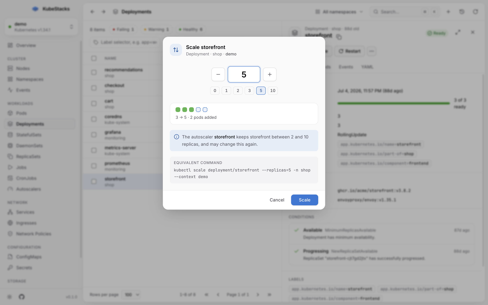                  |
| 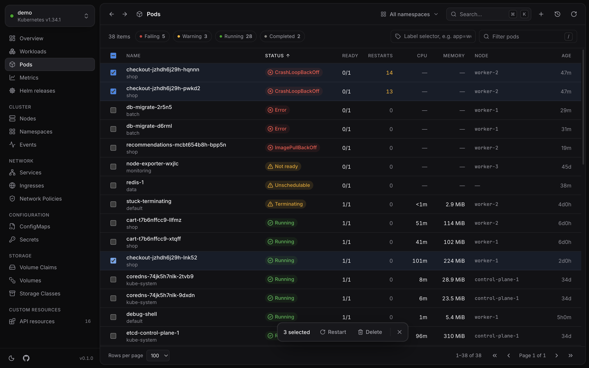           | 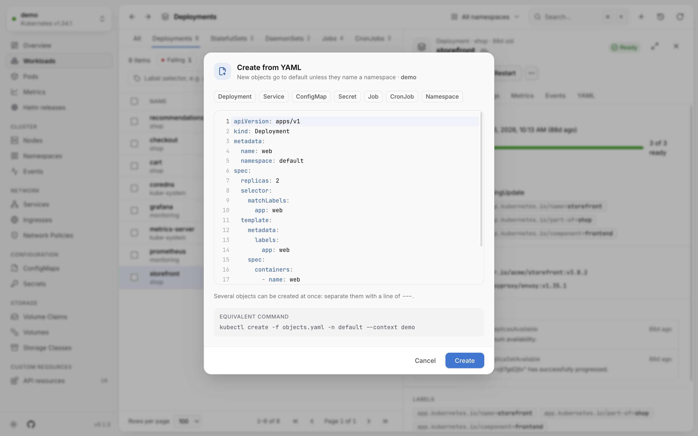                     |
| 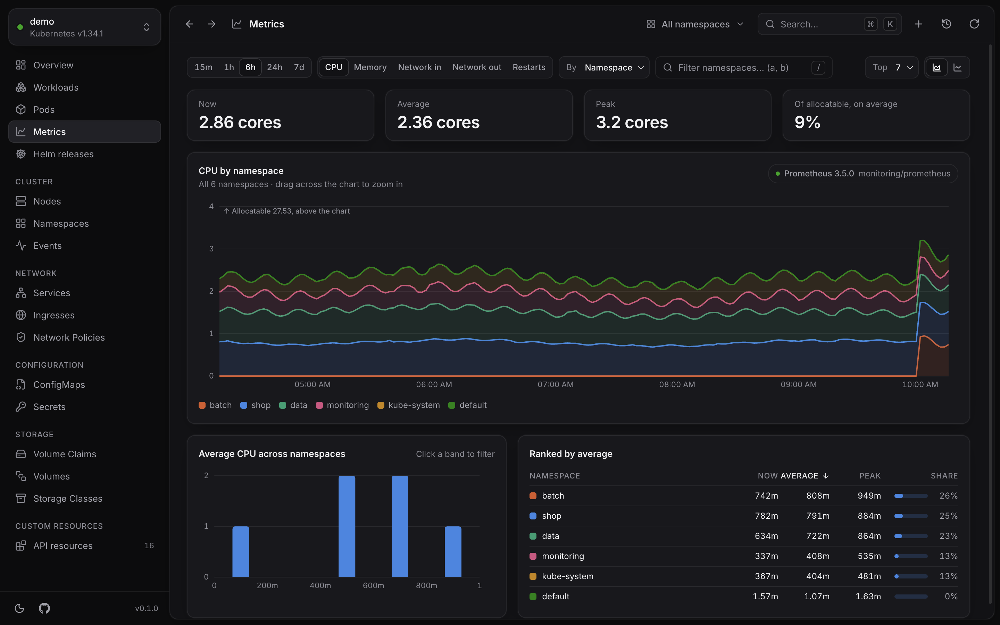             | 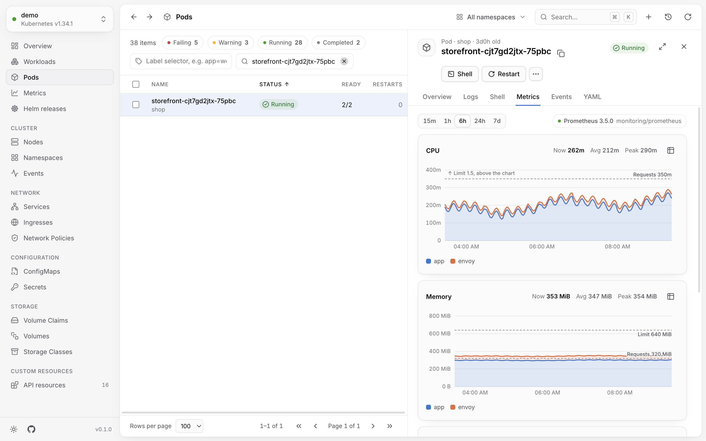           |
| 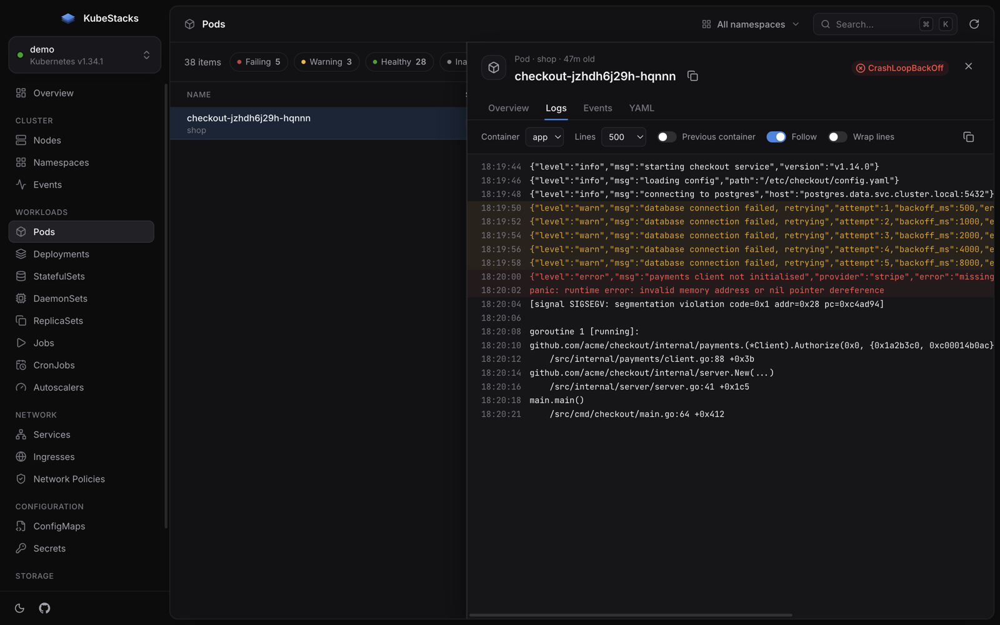                            | 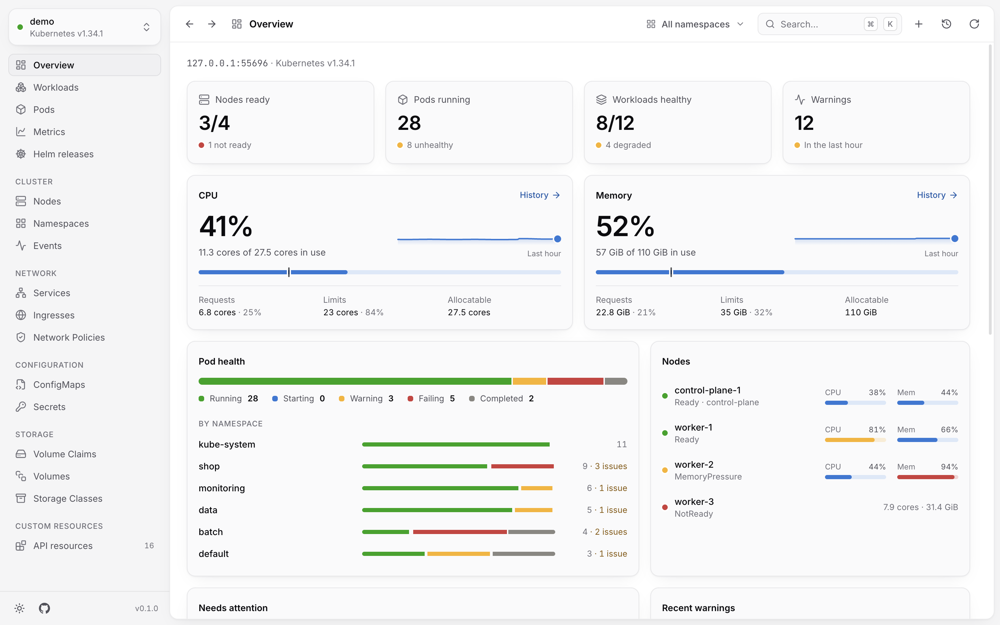             |
| 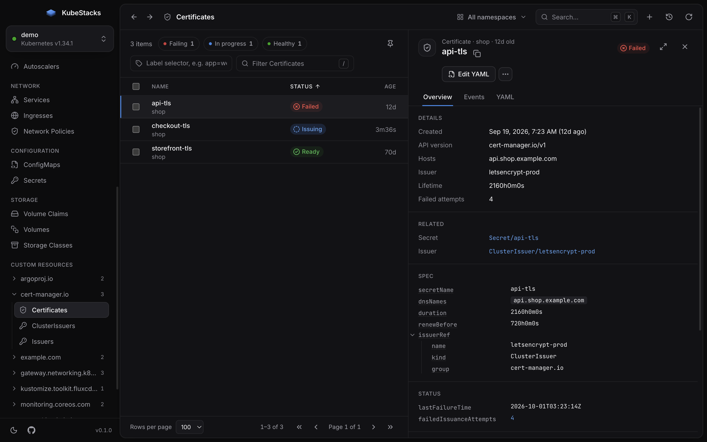             | 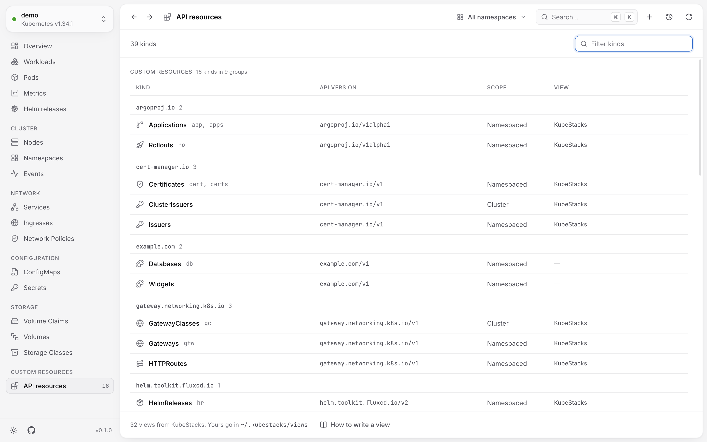 |
| 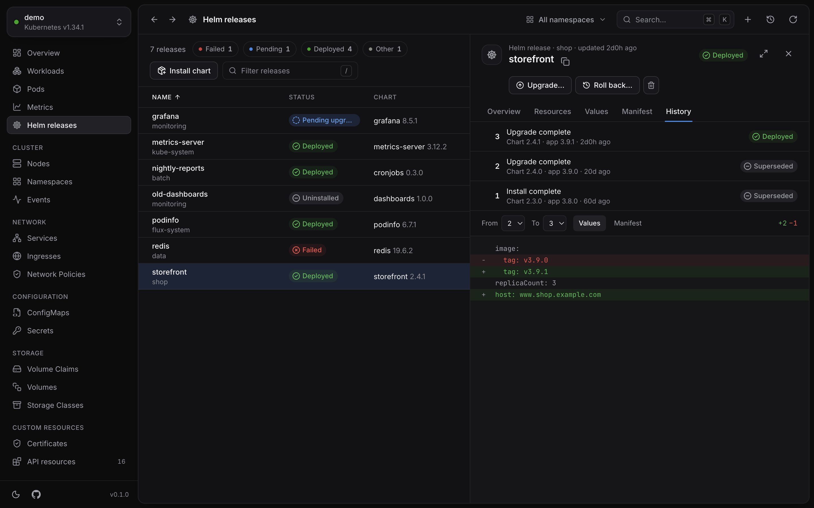        | 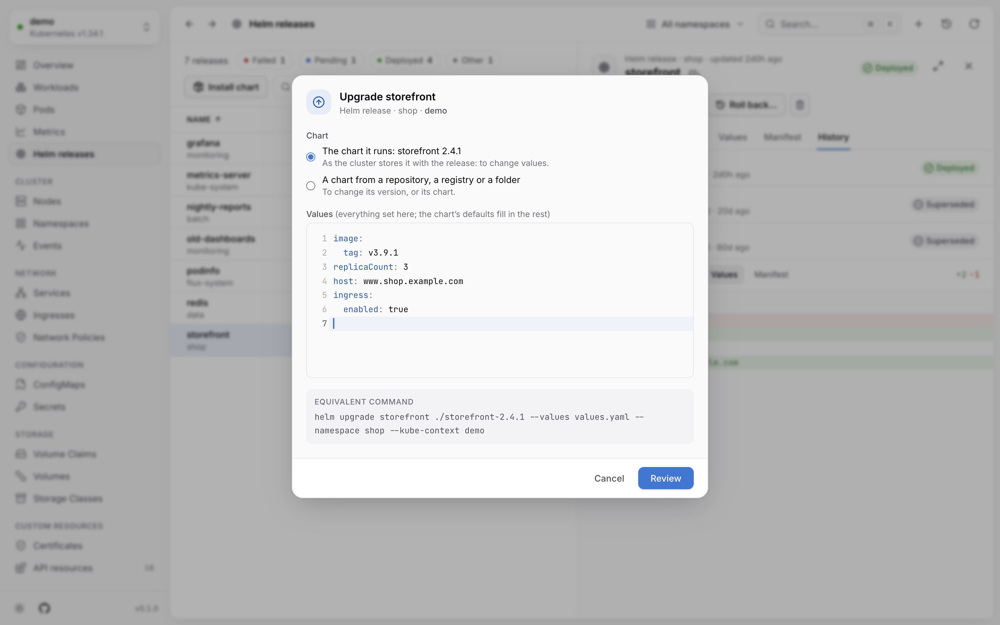       |

## Install

Download the installer for your platform from
[Releases](https://github.com/kotapeter/kubestacks/releases):

| Platform                      | Files                       |
| ----------------------------- | --------------------------- |
| macOS (Apple silicon & Intel) | `.dmg`, `.zip`              |
| Windows (x64 & arm64)         | `.exe` installer            |
| Linux (x64 & arm64)           | `.AppImage`, `.deb`, `.rpm` |

> The macOS app is signed and notarized by Apple. Windows builds aren't code-signed yet: if
> Windows says it protected your PC, choose **More info → Run anyway**. Each release lists
> the installers' SHA-256 checksums in `SHA256SUMS.txt`.

Or build it yourself: `npm ci && npm run dist` (Node.js 24 or later) puts the installers for
your platform in `release/`.

**Requirements.** macOS 12 or later, Windows 10 or later, or a recent 64-bit Linux, and
Kubernetes 1.25 or later (fields are explained from the cluster's OpenAPI schema from 1.27).
`kubectl` isn't needed; [Helm](https://helm.sh) is, only to change Helm releases.

**Privacy.** KubeStacks has no telemetry and no accounts. It connects to the clusters in your
kubeconfig, through them to the Prometheus you pick for usage history, and to
[Artifact Hub](https://artifacthub.io) only when you search it for charts.

## Using it

KubeStacks reads clusters from the same place `kubectl` does: the files listed in
`KUBECONFIG`, or `~/.kube/config`. Pick a cluster on the start screen; the status next to
each one tells you whether it is reachable and why not (expired credentials, certificate
problems, missing credential plugin…).

| Shortcut (macOS; `Ctrl` elsewhere) |                                                       |
| ---------------------------------- | ----------------------------------------------------- |
| `⌘K`                               | Command palette: views, objects, namespaces, clusters |
| `⌘1` … `⌘6`                        | Overview, Workloads, Pods, Services, Nodes, Events    |
| `G`, then a letter                 | Go to a view (`G W` workloads, `G D` deployments…)    |
| `⌘[` / `⌘]`, `Alt+←` / `Alt+→`     | Back / forward                                        |
| `⌘R`                               | Refresh now                                           |
| `⌘N`                               | Create from YAML                                      |
| `/`                                | Filter the list                                       |
| `↑` `↓` (or `J` `K`), `Home` `End` | Move through the list; `PgUp` `PgDn` jump ten rows    |
| `←` `→`                            | Previous / next page                                  |
| `Enter` / `Esc`                    | Open the focused row / close the detail panel         |
| `X` (`⇧X` for a range), `⌘A`       | Select the focused row / every row on the page        |
| `.`                                | Actions for the open object                           |
| `⌘⌫`                               | Delete the open object                                |
| `⌘S`                               | Review a YAML edit                                    |
| `⌘⇧C`                              | All clusters                                          |
| `?` or `⌘/`                        | All shortcuts, also in the **Help** menu              |

The sidebar shows each view's `G` shortcut when you hover it.

- **Workloads.** One list of every Deployment, StatefulSet, DaemonSet, Job and CronJob
  (and the Jobs, ReplicaSets and pods nothing manages), with each one's status, ready
  pods, autoscaler range, and CPU and memory added up over its pods, so problems of every
  kind sort to the top together. A tab per kind shows that kind's own list and columns.
  ReplicaSets a Deployment runs and Jobs a CronJob starts are left out; they're on their
  owner's panel, and in ⌘K. **Pods** have a list of their own.
- **Namespaces.** The namespace menu scopes every list. It starts in the namespace set on
  your kubeconfig context, and remembers your choice per cluster. If your account can't
  list namespaces, type one in.
- **Metrics.** Live usage needs [metrics-server](https://github.com/kubernetes-sigs/metrics-server).
  Without it, KubeStacks shows requests and limits against capacity instead.
- **Plain HTTP.** Clusters served over `http://` (for example through `kubectl proxy`) must
  set `insecure-skip-tls-verify: true` in the kubeconfig, the same rule as the official
  JavaScript client.
- **Huge clusters.** Lists are fetched in chunks of 500 and stop at 5,000 objects per list,
  with a note saying so; filter by label to see the rest. Set `KUBESTACKS_MAX_LIST_ITEMS`
  to change the limit.
- **Slow API servers.** Requests time out after 20 seconds. Set
  `KUBESTACKS_REQUEST_TIMEOUT_MS` to change that.

Settings that come from the environment (read at startup):

| Variable                        | What it does                                                     |
| ------------------------------- | ---------------------------------------------------------------- |
| `KUBECONFIG`                    | Where clusters come from, as for `kubectl`                       |
| `KUBESTACKS_READ_ONLY=1`        | Makes every cluster read-only, whatever is set in the app        |
| `KUBESTACKS_MAX_LIST_ITEMS`     | The most objects a list loads (5,000)                            |
| `KUBESTACKS_REQUEST_TIMEOUT_MS` | How long the API server has to answer (20,000)                   |
| `KUBESTACKS_VIEWS_DIR`          | Where your own views are (`~/.kubestacks/views`)                 |
| `KUBESTACKS_HELM`               | The `helm` to run (the one on your login shell's `PATH`)         |
| `KUBESTACKS_ARTIFACT_HUB_URL`   | The Artifact Hub to search for charts (`https://artifacthub.io`) |

### Changing things, safely

Open an object and its actions are right there: the common ones as buttons, the rest under
**⋯** (or `.`), in the row's right-click menu and in the command palette.

| Kind                                  | Actions                                                                                    |
| ------------------------------------- | ------------------------------------------------------------------------------------------ |
| Deployments, StatefulSets, DaemonSets | Scale, restart, change images, roll back to an earlier revision, pause or resume a rollout |
| Pods                                  | Shell, debug container, port forward, restart, evict, force-delete stuck pods              |
| Services                              | Port forward (to the service's first ready pod)                                            |
| CronJobs and Jobs                     | Run now, suspend, resume                                                                   |
| Nodes                                 | Cordon, uncordon, drain (with live progress per pod)                                       |
| Autoscalers, volume claims            | Change the replica range, expand the volume                                                |
| Everything                            | Edit labels and annotations, edit YAML, delete                                             |
| Selected rows                         | Restart, cordon or uncordon, suspend or resume, delete                                     |

The guard rails:

- **Your permissions, up front.** KubeStacks asks the cluster what you may do
  (SelfSubjectAccessReviews) and disables what you can't, saying why.
- **Nothing surprising.** Every dialog names the cluster and shows the equivalent `kubectl`
  command. YAML edits are validated by the cluster (a dry run) and shown as a diff before
  they are saved, and a change someone made meanwhile is caught instead of overwritten.
  Secret values are edited as text and saved encoded.
- **Hard to do by accident.** Destructive dialogs start on **Cancel**. Deleting namespaces,
  nodes and volumes — and anything in a cluster whose name looks like production (`prod`,
  `live`…) — asks you to type the name first (for several at once, what's being done).
  New objects are checked by the cluster before any of them is created.
- **Easy to take back.** Scaling, cordoning, suspending, pausing, image and label changes
  can be undone from their notification. The **Activity** log lists every change of the
  session with its command.
- **Read-only when you want it.** Turn changes off for a cluster in the cluster switcher, or
  for all clusters with `KUBESTACKS_READ_ONLY=1` (useful for shared machines). The main
  process enforces it, not just the interface. Shells count as changes; port forwards don't.

Shells run in a terminal in the pod's **Shell** tab (bash when the image has it, sh
otherwise). Port forwards listen on `localhost` only, are listed under the plug icon in the
header while they run, and stop when you stop them or quit.

### Usage history

Live usage comes from the metrics API (metrics-server), like `kubectl top`. History comes
from a Prometheus-compatible server in the cluster, reached through the API server's
service proxy with your own credentials, so nothing needs to be port-forwarded or exposed.

- **Found automatically.** KubeStacks looks among the cluster's services for Prometheus
  (kube-prometheus-stack, the Prometheus chart, kube-prometheus) and VictoriaMetrics
  (single-node `vmsingle` and the cluster version's `vmselect`), and uses the first that
  answers a query.
- **Or chosen.** Open **Metrics source** from the chip on any chart, or from the command
  palette, to pick a namespace, service, port and path (`/select/0/prometheus` for
  vmselect), test it, or turn history off for that cluster.
- **What it needs.** Your account needs `get` on `services/proxy` in the source's namespace.
  Charts use cAdvisor's `container_*` metrics; restarts come from kube-state-metrics, which
  also places pods on nodes when cAdvisor's series don't carry a `node` label.

### Custom resources

Every kind the cluster serves is in **API resources** (in the sidebar and the command
palette), like `kubectl api-resources`, with custom resources grouped by API group. The
sidebar stays short however many CRDs a cluster has: it keeps the custom resources you
opened last in that cluster, and the kinds you pin. ⌘K finds any kind by name, short name
or group.

- **What the cluster says.** Lists have the columns the API server prints for the kind (a
  CRD's printer columns), and objects a status read from the conventions most controllers
  follow: `Ready`-like conditions, kstatus' `Stalled` and `Reconciling`, a spec the
  controller hasn't caught up with, suspension, or a phase. Fields are explained by the
  kind's OpenAPI schema (Kubernetes 1.27 and later), and YAML edits are validated by it.
- **What a view adds.** A view gives a kind better columns and status, the facts that
  matter, links to related objects, and actions that patch it, all written as data.
  KubeStacks ships views for popular projects (see the list above); yours go in
  `~/.kubestacks/views` (or the folder in `KUBESTACKS_VIEWS_DIR`) and replace KubeStacks'
  for the same kind. [docs/views.md](docs/views.md) describes the format. Views can't run
  code: they only read fields and change objects with the patches they spell out, and
  every change shows its `kubectl` command and asks the cluster what you may do, like any
  other.
- **Scaling.** Kinds with the scale subresource (Argo Rollouts, say) can be scaled like
  Deployments.

### Helm releases

**Helm releases** (`G` then `H`) lists every release in the cluster, or the namespace you
picked, read from the Secrets (or ConfigMaps) Helm 3 and 4 keep them in, so looking needs
no helm and nothing beyond the right to list Secrets. A release shows its chart, the values
set for it (alone or merged with the chart's defaults), the objects its manifest makes with
their live status (and any that are missing), its notes, and its revisions, with a diff of
the values or the manifest between any two.

Changes go through your own `helm` (on your `PATH`, or the one in `KUBESTACKS_HELM`), so
hooks, three-way merges and Helm's own record of revisions work as they always do:

- **Upgrade** with new values, using the chart the release already runs (Helm stores it
  with the release, apart from subcharts) or another chart from a repository, an OCI
  registry or a folder, at any version the repository lists. KubeStacks runs it as a
  server-side dry run first and shows what the manifest would change, before anything
  does.
- **Roll back** to any earlier revision, seeing how much of its values and manifest differ.
- **Uninstall**, keeping the release's history if you want to roll it back into being.
- **Install** a chart found on [Artifact Hub](https://artifacthub.io) (or typed), starting
  from its default values, again reviewed as a dry run.
- **Charts on your computer**, for the chart you're working on: choose a chart folder or
  a packaged `.tgz` (or type its path, `~/` included). KubeStacks shows what it is, warns
  when it's another chart than the release runs or an older version, checks it with
  `helm lint` against your values (again before every review), downloads missing subcharts
  (`helm dependency update`), and loads the values files beside it (`values-prod.yaml`,
  `ci/*.yaml`). The next upgrade of that release starts from the same chart.

Releases that Flux's helm-controller manages say so, link to their `HelmRelease`, and warn
that Flux will put back changes made any other way. Every change shows its `helm` command,
and a cluster you made read-only can't be changed with Helm either.

## Development

You need [Node.js](https://nodejs.org) 26 (see `.nvmrc`; 24 also works) and npm.

```sh
npm ci
npm run dev:mock   # the app against a built-in demo cluster, no Kubernetes needed
npm run dev        # the app against your own kubeconfig
```

| Command                                 |                                                               |
| --------------------------------------- | ------------------------------------------------------------- |
| `npm run dev` / `dev:mock`              | Run with hot reload (real clusters / demo cluster)            |
| `npm run verify`                        | Everything CI checks: format, lint, types, e2e with coverage  |
| `npm run mock-cluster`                  | Start the demo clusters alone and print a kubeconfig for them |
| `npm run test:e2e`                      | Build with coverage instrumentation and run the e2e suite     |
| `npm run test:linux`                    | The same, on Linux in Docker, as CI runs it                   |
| `npm run coverage`                      | The above, plus a coverage report in `coverage/`              |
| `npm run coverage:check`                | Fail unless every file, line, branch and function is covered  |
| `npm run lint` / `typecheck` / `format` | Static checks                                                 |
| `npm run package`                       | Build an unpacked app for this platform in `release/`         |
| `npm run dist`                          | Build installers for this platform                            |

### How it's built

```
src/
  main/       Electron main process: kubeconfig loading, API requests, IPC, window
  preload/    The narrow, typed bridge exposed to the page as window.kubestacks
  renderer/   React UI (Tailwind CSS, TanStack Query, Radix, cmdk)
  shared/     Types and the resource registry used by both sides
tests/
  e2e/            Playwright tests that drive the real Electron app
  mock-cluster/   A mock Kubernetes API server with realistic demo clusters
  integration/    The same app against a real kind cluster
docs/             Views reference, and the README's screenshots
scripts/          Coverage tooling, screenshots, icon rendering
```

- **Security.** The page runs sandboxed with context isolation and no Node.js access, under
  a strict Content Security Policy. It can't navigate or open windows. Every IPC call is
  checked for its sender and validated in the main process, which is the only place that
  talks to clusters. Credentials never reach the page.
- **Talking to clusters.** Authentication comes from
  [`@kubernetes/client-node`](https://github.com/kubernetes-client/javascript); requests
  are plain REST calls with gzip, so any API path, including metrics and logs, works the
  same way.
- **Design.** Status colors are reserved for health and always come with an icon and a
  label; charts use a colorblind-validated palette in both themes.

### Testing

The e2e suite drives the actual Electron app with Playwright against a mock API server that
serves three demo clusters (a busy one with every kind of problem, an empty one without
metrics, and one with 2,500 pods) plus contexts that fail in every way a real one can:
offline, expired token, untrusted certificate, missing credential plugin, broken
kubeconfig entries and blocked plain HTTP.

The app's windows stay invisible while the tests run, never take focus and stay out of the
Dock, and what the tests copy stays in the app, so you can keep working. Set
`KUBESTACKS_E2E_FOREGROUND=1` to watch them.

`npm run test:linux` runs the suite on Linux in Docker, the way CI does (Xvfb, no mouse), so
Linux-only problems show up before you push. It takes about as long as a local run.

**Coverage is 100% for statements, branches, functions and lines, measured end-to-end.** The
build is instrumented with Istanbul, and coverage is collected from all three Electron
processes (main, preload and renderer). A few lines only run on one operating system, such
as native title-bar colors on Windows and Linux, so CI runs the suite on Linux, macOS and
Windows and enforces 100% on the merged result. Locally, `npm run coverage` shows what your
platform reaches.

CI also packages the app on every platform and runs tests against the packaged build.

### Integration tests

The e2e tests above run against mock API servers, so they're fast and can stage any state.
The integration tests check the same app against a real cluster: a three-node
[kind](https://kind.sigs.k8s.io) cluster with metrics-server and kube-prometheus-stack.
They change things for real and check the result with kubectl: scaling, rollouts and
rollbacks, YAML edits and conflicts, creating from YAML, cordoning and draining against a
PodDisruptionBudget, shells, port forwards, debug containers, every usage-history query
against Prometheus, custom resources (a CRD of their own, with validation, status and
scaling, and the Prometheus operator's through KubeStacks' views), Helm releases (read in
both storage drivers, upgraded, rolled back and uninstalled with helm, and a chart installed
from a folder), and what a view-only account is offered.

You need Docker, [kind](https://kind.sigs.k8s.io), kubectl and Helm.

```sh
npm run kind:up            # create the cluster and install metrics-server and Prometheus (a few minutes)
npm run test:integration   # build, then run the integration tests
npm run kind:down          # delete the cluster
```

The cluster gets its own kubeconfig in `.kind/`. Your `~/.kube/config` isn't read or
changed, and the tests never use any other cluster. The tests can be rerun against the same
cluster: each spec starts from a fresh namespace.

## Contributing

Contributions are welcome. Please read [CONTRIBUTING.md](CONTRIBUTING.md) first, and see
[SECURITY.md](SECURITY.md) for reporting vulnerabilities.

## License

[Apache License 2.0](LICENSE)
