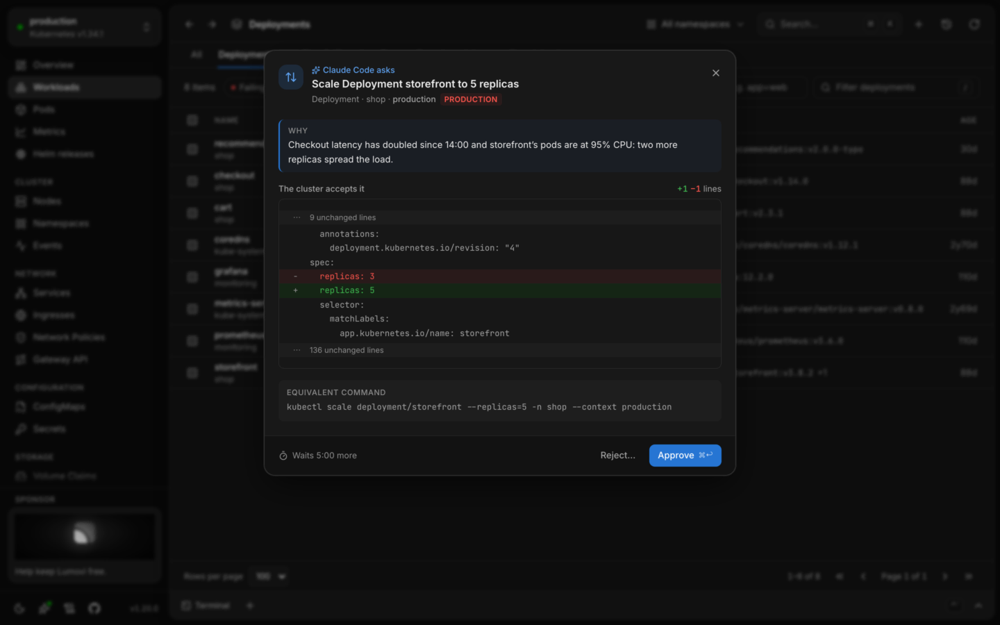
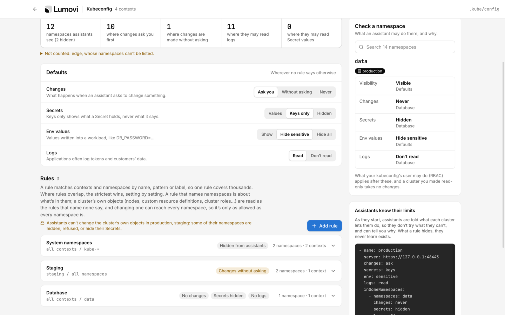
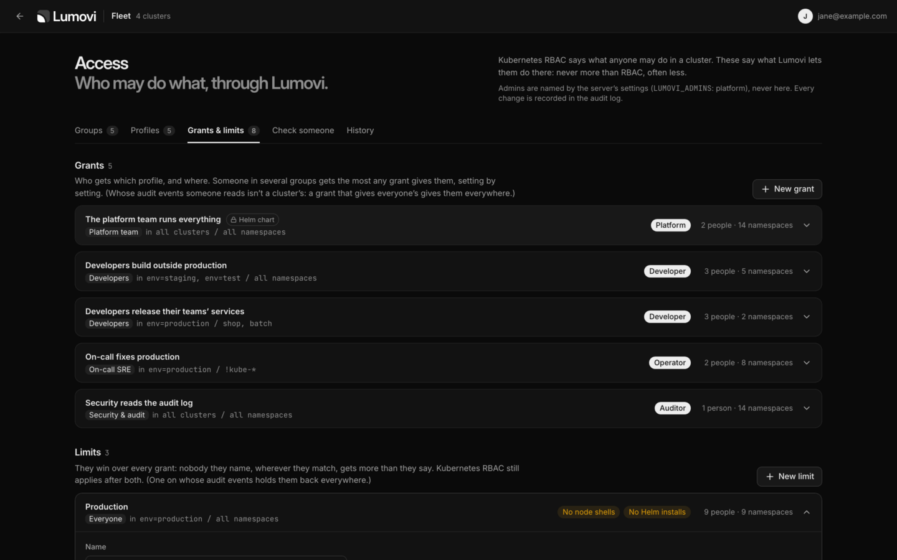
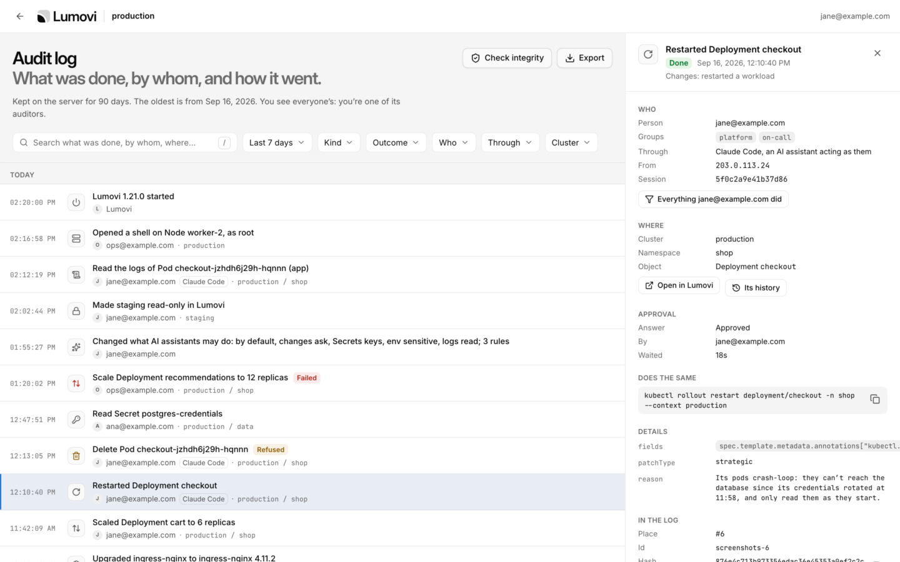

<div align="center">

<picture>
  <source media="(prefers-color-scheme: dark)" srcset="src/renderer/src/assets/lumovi-logo-on-dark.svg" />
  
</picture>

<br />
<br />

**A calm, fast Kubernetes dashboard, on your desktop or in your cluster.**

See what's healthy, what's struggling and where your capacity goes, and fix things safely
when they need it. Use it as a desktop app for every cluster in your kubeconfig, or host it
in your own cluster for your whole team to open in a browser.

[](https://github.com/Lumovi/Lumovi/releases/latest)
[](https://github.com/Lumovi/Lumovi/actions/workflows/ci.yml)
[](docs/development.md#testing)
[](LICENSE)
[](https://github.com/sponsors/Lumovi)

[**Download**](#desktop-app) · [**Install in a cluster**](#in-your-cluster) ·
[**Documentation**](https://docs.lumovi.dev) · [**lumovi.dev**](https://lumovi.dev)

</div>

<picture>
  <source media="(prefers-color-scheme: dark)" srcset="docs/screenshots/overview-dark.webp" />
  
</picture>

## Two ways to run it

Lumovi is one app, built from one codebase and released as one version. Run it where it
suits you:

|                | Desktop app                                   | In your cluster                                                                                  |
| -------------- | --------------------------------------------- | ------------------------------------------------------------------------------------------------ |
| **For**        | You, on your own computer                     | Your team, in a browser                                                                          |
| **Clusters**   | Every cluster in your kubeconfig              | The cluster it's installed in, or a fleet of clusters                                            |
| **Signing in** | Your kubeconfig's credentials                 | A token, single sign-on (OpenID Connect) or an authenticating proxy, with each person's own RBAC |
| **Install**    | Installers for macOS, Windows and Linux       | A Helm chart, or the container image                                                             |
| **Updates**    | Updates itself                                | `helm upgrade`                                                                                   |
| **Only here**  | Port forwarding, terminals, local Helm charts | Who may do what (Access), links to any page the whole team can open, and nothing to install      |

## Features

- **Health at a glance.** Every object gets a clear status (Running, CrashLoopBackOff,
  Degraded, NotReady, Pending…), and problems sort to the top. The overview lists what needs
  attention and the most recent warnings.
- **Resource consumption.** Live CPU and memory from metrics-server against allocatable
  capacity, with requests and limits, per-node meters, usage trends and the busiest pods.
- **Usage over time.** Lumovi finds your Prometheus or VictoriaMetrics and charts what
  the cluster uses, from the last 15 minutes to the last week, ranked and compared by
  namespace, workload, pod and node, and set against requests, limits and capacity.
- **Right-sizing.** What each workload should request, from a week of its usage: what's
  over-provisioned, what was OOM-killed or throttled, and what requests nothing, each with
  its reasons and its week charted. Applied after the API server checks it, with undo.
- **Map.** Every object's connections: from the gateway, ingress and service in front of it,
  through the workload and its pods, to the ConfigMaps, Secrets and volumes they use and the
  nodes they run on. What's missing, unwell or unused stands out.
- **Every kind.** Workloads of every kind in one list, and pods, nodes, namespaces, events,
  services, ingresses, network policies, config maps, secrets, volumes and the rest. Custom
  resources are found through discovery, with the columns `kubectl get` shows and a status
  read from their conditions; views for cert-manager, Argo CD, Flux, Gateway API, Karpenter,
  KEDA, Istio, Crossplane and more add the columns, related objects, links and actions that
  matter, and you can write your own.
- **Your tools, each in its place.** Every tool the cluster runs gets an entry in the
  sidebar, with everything of its kinds on one page and what's failing first. Karpenter's
  shows its node pools against their limits, the nodes they launched, what's being replaced
  and the pods waiting for a node.
- **Helm releases.** Every release in the cluster, its values, what it made and how that's
  doing, and every revision with a diff between any two. Upgrade (reviewed as a server-side
  dry run first), roll back, uninstall, or install a chart found on Artifact Hub.
- **Detail without digging.** A side panel with the facts that matter per kind, container
  state, conditions, related objects, events, logs and syntax-highlighted YAML. Secret values
  stay hidden until you reveal them.
- **Logs as they're written.** One pod's logs, or every pod of a workload merged in the order
  they were written. Search, keep only errors or warnings, read a crashed container's
  previous run, and copy or download what you see.
- **Hands-on when you need it.** A shell in any container or on any node, debug containers
  with tools for running pods (distroless ones too), and port forwarding to pods and
  services. On the desktop, terminals with kubectl already pointed at the cluster you're
  looking at (a kubectl of the cluster's own version, as Kubernetes supports it), and every
  action's equivalent command a click away from running there.
- **Safe changes.** Scale, restart, roll back, change images, run CronJobs, cordon and drain
  nodes, edit labels or any object's YAML, create objects from YAML, one object or many at
  once. Every change checks your permissions first, shows the equivalent `kubectl` command,
  and can be undone from its notification where that makes sense. Clusters can be made
  read-only.
- **AI assistants, with you in charge.** Lumovi is an MCP server, so any AI agent can work
  through it: Claude Code, Codex, Cursor, VS Code, Claude Desktop and the rest look at your
  clusters and change them with your own permissions. Their changes ask you first unless you
  let them go ahead, and what they may see, change and read (Secrets, env values, logs) is
  yours to set, everywhere or cluster by cluster and namespace by namespace. On a team's
  Lumovi, people allow each assistant themselves, and its admins set limits.
- **Built for big clusters.** Lists load in chunks, paginated and virtualized, so thousands of
  pods stay smooth.
- **Keyboard first.** Every view is a shortcut away, and `⌘K` / `Ctrl+K` jumps to any view,
  object, namespace or cluster.
- **Calm when things go wrong.** A lost connection shows a banner and keeps the last data on
  screen, and an unexpected error says what happened instead of leaving a blank page.
- **A fleet of clusters.** One Lumovi in a browser for many clusters, each person seeing each
  one as their own RBAC there allows. Every cluster is summed up on one page, what needs
  attention first, with labels to filter and group by and a search for workloads across all
  of them. It runs in a cluster, on a VM or on a platform like Sevalla, and reaches private
  clusters through an agent that dials out.
- **Access for your team.** On a team's Lumovi, its admins decide who may do what through
  it, within Kubernetes RBAC and never more: profiles of changes, shells, logs, Secrets, Helm
  and AI assistants, granted to groups in some clusters and namespaces, and limits that hold
  anyone back. The server enforces it, and everyone sees what they may do, and why.
- **An audit log.** What was done through Lumovi, by whom, from where and how it went:
  changes with how each was approved, shells, logs and Secrets read, sign-ins and settings.
  Each event holds the hash of the one before it, so anyone can check the log with `jq`; on a
  server it also goes to the cluster's log collector and a webhook, and auditors see
  everyone's.
- **Light and dark.** Follows your system, or pick one.

|                                                                                                     |                                                                                               |
| --------------------------------------------------------------------------------------------------- | --------------------------------------------------------------------------------------------- |
|                               |                                         |
|                                             |                                  |
|                                         |                                     |
|                                           |                           |
|                                                          |                             |
|                                  |                 |
|                                      |                       |
|                           |                         |
|  |  |
|                    |                                         |

More, light and dark: [docs/screenshots](docs/screenshots).

## Getting started

### Desktop app

Download the installer for your platform from the
[latest release](https://github.com/Lumovi/Lumovi/releases/latest):

| Platform                      | Files                       |
| ----------------------------- | --------------------------- |
| macOS (Apple silicon & Intel) | `.dmg`, `.zip`              |
| Windows (x64 & arm64)         | `.exe` installer            |
| Linux (x64 & arm64)           | `.AppImage`, `.deb`, `.rpm` |

On a Mac, Homebrew installs it too:

```sh
brew install --cask lumovi/tap/lumovi
```

Open it and pick a cluster: Lumovi reads them from the same place `kubectl` does
(`KUBECONFIG`, or `~/.kube/config`), credential plugins included. It keeps itself up to date:
a new version downloads in the background and installs when you restart the app.

> The macOS app is signed and notarized by Apple, and the Windows installer is signed by
> Open Source Developer Péter Kóta (Certum). Until enough people have installed it, Windows
> may still say it protected your PC: choose **More info → Run anyway**.

To build it yourself: `npm ci && npm run dist` (Node.js 24 or later) puts the installers for
your platform in `release/`. More in
[Get started on the desktop](https://docs.lumovi.dev/get-started/desktop).

### In your cluster

Install the Helm chart, then open Lumovi through a port forward:

```sh
helm install lumovi oci://ghcr.io/lumovi/charts/lumovi \
  --namespace lumovi --create-namespace
kubectl port-forward --namespace lumovi service/lumovi 8080:80
```

Open <http://localhost:8080> and sign in with a token the cluster accepts. Lumovi sends
your requests with it, so its permissions apply: a service account's, for example, valid for
an hour:

```sh
kubectl create token NAME --namespace NAMESPACE
```

For your team, give it an address of its own with the chart's ingress, and sign people in
with your identity provider:

```yaml
url: https://lumovi.example.com
ingress:
  enabled: true
  hosts: [lumovi.example.com]
auth:
  mode: oidc
  oidc:
    issuer: https://login.example.com
    clientId: lumovi
    existingSecret: lumovi-oidc # the client's secret, under client-secret
```

The image, `ghcr.io/lumovi/lumovi` (`linux/amd64` and `linux/arm64`), runs as a
non-root user without a shell, and also runs
[outside Kubernetes](https://docs.lumovi.dev/server/docker) against a kubeconfig. See
[Lumovi in your cluster](https://docs.lumovi.dev/server/overview) for single sign-on
and authenticating proxies, ingress, security and every setting.

For many clusters, run one Lumovi as a [fleet](https://docs.lumovi.dev/server/fleet): in a
cluster, on a VM, or on a platform like Sevalla, with no Kubernetes of its own. Each cluster
joins it with a service account that may only impersonate (the chart's `mode: member`), or
through an agent that dials out (`mode: agent`) when Lumovi can't reach it.

## Documentation

The documentation is at **[docs.lumovi.dev](https://docs.lumovi.dev)**:

| Guide                                                                 | What it covers                                                                                         |
| --------------------------------------------------------------------- | ------------------------------------------------------------------------------------------------------ |
| [Get started](https://docs.lumovi.dev/get-started/desktop)            | Installing the desktop app or Lumovi in your cluster, and a tour                                       |
| [Using Lumovi](https://docs.lumovi.dev/explore/overview)              | Finding your way, changing things safely, logs, shells, metrics, Helm, AI assistants and the audit log |
| [Custom resources](https://docs.lumovi.dev/custom-resources/overview) | The views Lumovi comes with, and writing your own                                                      |
| [In your cluster](https://docs.lumovi.dev/server/overview)            | Installing with Helm, signing in, who may do what, security and configuration                          |
| [Reference](https://docs.lumovi.dev/reference/keyboard-shortcuts)     | Shortcuts, settings, the view format, troubleshooting and FAQ                                          |

In this repository: [Development](docs/development.md) (building, architecture and testing),
and the [Changelog](CHANGELOG.md).

## Security and privacy

- **Your permissions, nothing more.** Lumovi asks the cluster what you may do before
  offering it. In a cluster, everyone signs in and works with their own RBAC, the browser
  keeps nothing but a session cookie, and Lumovi never acts as Kubernetes' own users or
  groups.
- **No telemetry, no accounts.** The desktop app connects only to your clusters (and through
  them to Prometheus), to the chart repositories and registries you install or upgrade from,
  to [Artifact Hub](https://artifacthub.io) when you search it for charts, to
  [dl.k8s.io](https://dl.k8s.io) for the kubectl each terminal gets, and to GitHub, to look
  for new versions and to read the sidebar's sponsor card from
  [Lumovi/main-sponsor](https://github.com/Lumovi/main-sponsor) a few seconds after it starts
  and every hour. Getting kubectl and looking for new versions can be turned off. Reading the
  card can't, and sends nothing but the request: no cookies, no IDs, nothing about you or your
  clusters. See
  [what it connects to](https://docs.lumovi.dev/reference/privacy-and-security#what-it-connects-to).
- **Verifiable releases.** Every installer, the image and the chart carry a signed build
  provenance attestation (`gh attestation verify <file> --repo Lumovi/Lumovi`) and a
  software bill of materials; the image and the chart are signed with cosign; and each
  release lists its installers' SHA-256 checksums. See
  [Checking a release](SECURITY.md#checking-a-release).
- **For a company's computers and clusters.** Its proxy and certificate authorities, a
  [policy](https://docs.lumovi.dev/desktop/policy) that locks what IT sets on every desktop,
  and a chart that runs as non-root, read-only and under OpenShift's restricted SCC.
- **Reporting a vulnerability.** See [SECURITY.md](SECURITY.md).

## Requirements

- **Kubernetes** 1.25 or later. Fields are explained from the cluster's OpenAPI schema from
  1.27, and signing in to Lumovi in a cluster with a token needs 1.28.
- **Desktop:** macOS 13 or later, Windows 10 or later, or a recent 64-bit Linux. Neither
  `kubectl` nor [Helm](https://helm.sh) is needed: Lumovi ships with the helm it runs.
- **In a cluster:** Helm 3.8 or later to install the chart, on `linux/amd64` or
  `linux/arm64` nodes. The image includes everything else.

## Lumovi and other tools

Lens, Freelens, Headlamp, k9s and the Kubernetes Dashboard do much of what Lumovi does. Three
things, taken together, are what we found in none of them: an audit log of what's done through
it, team rules on top of RBAC in an open-source tool, and an MCP server AI agents change things
through, with your approval.
[Lumovi and other Kubernetes tools](https://docs.lumovi.dev/reference/compare) compares them,
with sources, and says when another is the better pick.

## Questions and support

Ask in [Discussions](https://github.com/Lumovi/Lumovi/discussions): questions in
[Q&A](https://github.com/Lumovi/Lumovi/discussions/categories/q-a), ideas in
[Ideas](https://github.com/Lumovi/Lumovi/discussions/categories/ideas). Bugs go to
[issues](https://github.com/Lumovi/Lumovi/issues/new/choose), and security problems are
reported privately, as [SECURITY.md](SECURITY.md) says.

## Contributing

Contributions are welcome. Please read [CONTRIBUTING.md](CONTRIBUTING.md) first, and
[docs/development.md](docs/development.md) to build and test Lumovi.

A good first contribution is support for a tool you run: an add-on and views, written as YAML
and checked against the tool's CRDs, with no code to write. See
[Adding a tool](CONTRIBUTING.md#adding-a-tool).

## Sponsoring

Lumovi is free and open source, made in spare time. If it saves you time, you can
[sponsor its development](https://github.com/sponsors/Lumovi) on GitHub. The app's **Help**
menu and the card in its sidebar lead to the same page.

## License

[Apache License 2.0](LICENSE)
