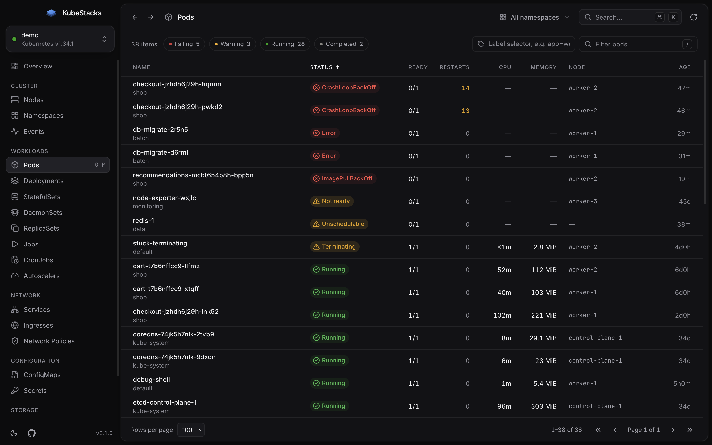

<div align="center">


# KubeStacks

**A beautiful, fast, read-only Kubernetes cluster viewer for the desktop.**

See what's healthy, what's struggling and where your capacity goes, across every cluster in your kubeconfig.

[](https://github.com/kotapeter/kubestacks/actions/workflows/ci.yml)
[](#testing)
[](LICENSE)

macOS · Windows · Linux

</div>


## Why KubeStacks

Most Kubernetes dashboards are either a terminal or a wall of tables. KubeStacks is a calm,
focused desktop app for _looking_ at clusters: it surfaces problems first, shows live
resource usage next to what's allocatable, and gets out of your way. It never changes
anything in your cluster.

- **Health at a glance.** Every object gets a clear status (Running, CrashLoopBackOff,
  Degraded, NotReady, Pending…), and problems sort to the top. The overview lists what
  needs attention and the most recent warnings.
- **Resource consumption.** Live CPU and memory from metrics-server against allocatable
  capacity, with requests and limits, per-node meters, usage trends and the busiest pods.
- **Every common kind.** Nodes, namespaces, events, pods, deployments, stateful sets,
  daemon sets, replica sets, jobs, cron jobs, autoscalers, services, ingresses, network
  policies, config maps, secrets, volume claims, volumes and storage classes.
- **Detail without digging.** A side panel with the facts that matter per kind, container
  state and restarts, conditions, labels, related pods, events, logs and syntax-highlighted
  YAML. Secret values stay hidden until you reveal them.
- **Fast everywhere.** Virtualized tables handle thousands of objects; lists refresh every
  few seconds without flicker; `⌘K` / `Ctrl+K` jumps to any view, namespace or cluster.
- **Works with your kubeconfig.** Multiple files via `KUBECONFIG`, kubectl's merge rules,
  client certificates, tokens and exec credential plugins (`gke-gcloud-auth-plugin`,
  `aws eks get-token`, `kubelogin`…), including when launched from the Dock.
- **Light and dark.** Follows your system, or pick one. Native window controls match.

|                                         |                                                                |
| --------------------------------------- | -------------------------------------------------------------- |
|  |                  |
|  |  |

## Install

Download the installer for your platform from the
[latest release](https://github.com/kotapeter/kubestacks/releases):

| Platform                      | Files                       |
| ----------------------------- | --------------------------- |
| macOS (Apple silicon & Intel) | `.dmg`, `.zip`              |
| Windows (x64 & arm64)         | `.exe` installer            |
| Linux (x64 & arm64)           | `.AppImage`, `.deb`, `.rpm` |

> Early builds are not code-signed yet. On macOS, right-click the app and choose **Open**
> the first time; on Windows, choose **More info → Run anyway**.

## Using it

KubeStacks reads clusters from the same place `kubectl` does: the files listed in
`KUBECONFIG`, or `~/.kube/config`. Pick a cluster on the start screen; the status next to
each one tells you whether it is reachable and why not (expired credentials, certificate
problems, missing credential plugin…).

| Shortcut        |                                                     |
| --------------- | --------------------------------------------------- |
| `⌘K` / `Ctrl+K` | Command palette: views, namespaces, clusters, theme |
| `Esc`           | Close the detail panel                              |
| `Enter`         | Open the focused row                                |

- **Namespaces.** The namespace menu scopes every list. It starts in the namespace set on
  your kubeconfig context, and remembers your choice per cluster. If your account can't
  list namespaces, type one in.
- **Metrics.** Live usage needs [metrics-server](https://github.com/kubernetes-sigs/metrics-server).
  Without it, KubeStacks shows requests and limits against capacity instead.
- **Plain HTTP.** Clusters served over `http://` (for example through `kubectl proxy`) must
  set `insecure-skip-tls-verify: true` in the kubeconfig, the same rule as the official
  JavaScript client.
- **Slow API servers.** Requests time out after 20 seconds. Set
  `KUBESTACKS_REQUEST_TIMEOUT_MS` to change that.

### Read-only by design

KubeStacks only ever issues `GET` requests. There is no create, edit, delete, exec,
port-forward or app install. That makes it safe to hand to anyone who needs to _see_ a
cluster, and it keeps the interface focused.

## Development

You need [Node.js](https://nodejs.org) 26 (see `.nvmrc`; 24 also works) and npm.

```sh
npm ci
npm run dev:mock   # the app against a built-in demo cluster, no Kubernetes needed
npm run dev        # the app against your own kubeconfig
```

| Command                                 |                                                               |
| --------------------------------------- | ------------------------------------------------------------- |
| `npm run dev` / `dev:mock`              | Run with hot reload (real clusters / demo cluster)            |
| `npm run mock-cluster`                  | Start the demo clusters alone and print a kubeconfig for them |
| `npm run test:e2e`                      | Build with coverage instrumentation and run the e2e suite     |
| `npm run coverage`                      | The above, plus a coverage report in `coverage/`              |
| `npm run coverage:check`                | Fail unless every file, line, branch and function is covered  |
| `npm run lint` / `typecheck` / `format` | Static checks                                                 |
| `npm run package`                       | Build an unpacked app for this platform in `release/`         |
| `npm run dist`                          | Build installers for this platform                            |

### How it's built

```
src/
  main/       Electron main process: kubeconfig loading, API requests, IPC, window
  preload/    The narrow, typed bridge exposed to the page as window.kubestacks
  renderer/   React UI (Tailwind CSS, TanStack Query, Radix, cmdk)
  shared/     Types and the resource registry used by both sides
tests/
  e2e/            Playwright tests that drive the real Electron app
  mock-cluster/   A mock Kubernetes API server with realistic demo clusters
```

- **Security.** The page runs sandboxed with context isolation and no Node.js access, under
  a strict Content Security Policy. It can't navigate or open windows. Every IPC call is
  checked for its sender and validated in the main process, which is the only place that
  talks to clusters. Credentials never reach the page.
- **Talking to clusters.** Authentication comes from
  [`@kubernetes/client-node`](https://github.com/kubernetes-client/javascript); requests
  are plain `GET`s with gzip, so any API path, including metrics and logs, works the same
  way.
- **Design.** Status colors are reserved for health and always come with an icon and a
  label; charts use a colorblind-validated palette in both themes.

### Testing

The e2e suite drives the actual Electron app with Playwright against a mock API server that
serves three demo clusters (a busy one with every kind of problem, an empty one without
metrics, and one with 2,500 pods) plus contexts that fail in every way a real one can:
offline, expired token, untrusted certificate, missing credential plugin, broken
kubeconfig entries and blocked plain HTTP.

**Coverage is 100% for statements, branches, functions and lines, measured end-to-end.** The
build is instrumented with Istanbul, and coverage is collected from all three Electron
processes (main, preload and renderer). A few lines only run on one operating system, such
as native title-bar colors on Windows and Linux, so CI runs the suite on Linux, macOS and
Windows and enforces 100% on the merged result. Locally, `npm run coverage` shows what your
platform reaches.

CI also packages the app on every platform and runs tests against the packaged build, and it
runs a smoke test against a real [kind](https://kind.sigs.k8s.io) cluster. To run that
locally:

```sh
kind create cluster --name kubestacks
KUBESTACKS_E2E_REAL_CONTEXT=kind-kubestacks npx playwright test real-cluster
```

## Contributing

Contributions are welcome. Please read [CONTRIBUTING.md](CONTRIBUTING.md) first, and see
[SECURITY.md](SECURITY.md) for reporting vulnerabilities.

## License

[Apache License 2.0](LICENSE)
