<div align="center">

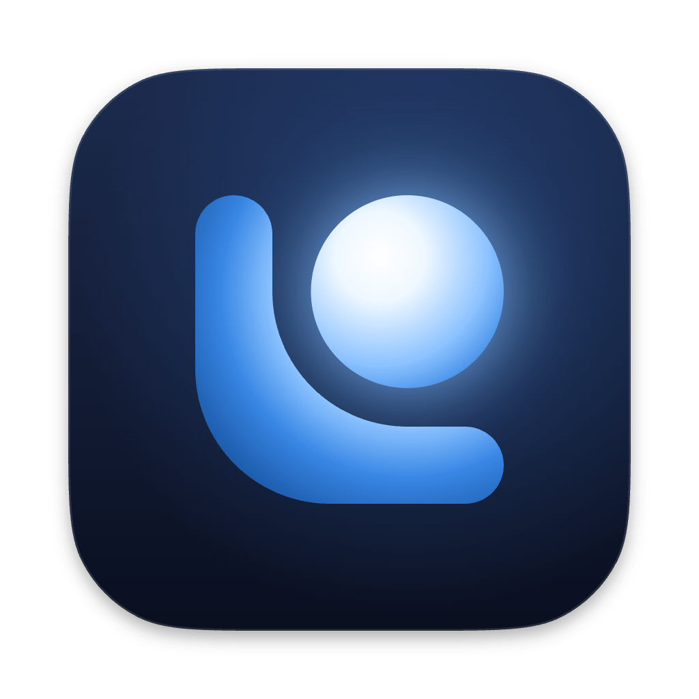

# KubeStacks

**A beautiful, fast Kubernetes dashboard. On your desktop, or in your cluster.**

See what's healthy, what's struggling and where your capacity goes, and fix things safely
when they need it. Use it as a desktop app for every cluster in your kubeconfig, or host it
in your own cluster for your whole team to open in a browser.

[](https://github.com/KubeStacks/KubeStacks/releases/latest)
[](https://github.com/KubeStacks/KubeStacks/actions/workflows/ci.yml)
[](docs/development.md#testing)
[](LICENSE)
[](https://github.com/sponsors/kotapeter)

[**Download**](#desktop-app) · [**Install in a cluster**](#in-your-cluster) ·
[**Documentation**](https://docs.kubestacks.com) · [**kubestacks.com**](https://kubestacks.com)

</div>

<picture>
  <source media="(prefers-color-scheme: dark)" srcset="docs/screenshots/overview-dark.webp" />
  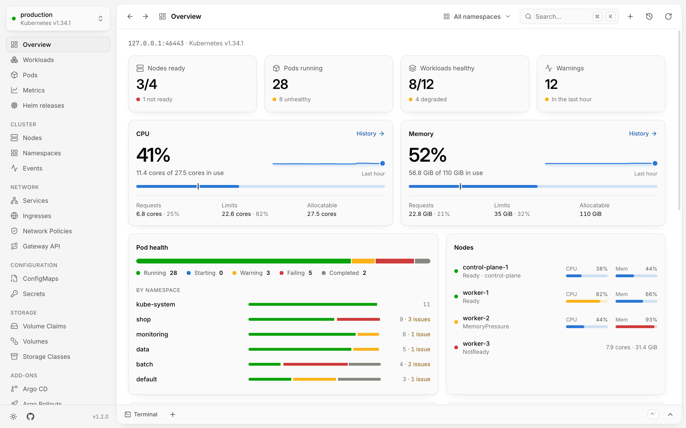
</picture>

## Two ways to run it

KubeStacks is one app, built from one codebase and released as one version. Run it where it
suits you:

|                | Desktop app                                     | In your cluster                                                                                  |
| -------------- | ----------------------------------------------- | ------------------------------------------------------------------------------------------------ |
| **For**        | You, on your own computer                       | Your team, in a browser                                                                          |
| **Clusters**   | Every cluster in your kubeconfig                | The cluster it's installed in                                                                    |
| **Signing in** | Your kubeconfig's credentials                   | A token, single sign-on (OpenID Connect) or an authenticating proxy, with each person's own RBAC |
| **Install**    | Installers for macOS, Windows and Linux         | A Helm chart, or the container image                                                             |
| **Updates**    | Updates itself                                  | `helm upgrade`                                                                                   |
| **Only here**  | Port forwarding, Helm charts from your computer | Links to any page that the whole team can open, and nothing to install                           |

## Features

- **Health at a glance.** Every object gets a clear status (Running, CrashLoopBackOff,
  Degraded, NotReady, Pending…), and problems sort to the top. The overview lists what needs
  attention and the most recent warnings.
- **Resource consumption.** Live CPU and memory from metrics-server against allocatable
  capacity, with requests and limits, per-node meters, usage trends and the busiest pods.
- **Usage over time.** KubeStacks finds your Prometheus or VictoriaMetrics and charts what
  the cluster uses, from the last 15 minutes to the last week, ranked and compared by
  namespace, workload, pod and node, and set against requests, limits and capacity.
- **Every kind.** Workloads of every kind in one list, and pods, nodes, namespaces, events,
  services, ingresses, network policies, config maps, secrets, volumes and the rest. Custom
  resources are found through discovery, with the columns `kubectl get` shows and a status
  read from their conditions; views for cert-manager, Argo CD, Flux, Gateway API, Karpenter,
  KEDA, Istio, Crossplane and more add the columns, related objects, links and actions that
  matter, and you can write your own.
- **Your tools, each in its place.** Every tool the cluster runs gets an entry in the
  sidebar, with everything of its kinds on one page and what's failing first. Karpenter's
  shows its node pools against their limits, the nodes they launched, what's being replaced
  and the pods waiting for a node.
- **Helm releases.** Every release in the cluster, its values, what it made and how that's
  doing, and every revision with a diff between any two. Upgrade (reviewed as a server-side
  dry run first), roll back, uninstall, or install a chart found on Artifact Hub.
- **Detail without digging.** A side panel with the facts that matter per kind, container
  state, conditions, related objects, events, logs and syntax-highlighted YAML. Secret values
  stay hidden until you reveal them.
- **Logs as they're written.** One pod's logs, or every pod of a workload merged in the order
  they were written. Search, keep only errors or warnings, read a crashed container's
  previous run, and copy or download what you see.
- **Hands-on when you need it.** A shell in any container, debug containers with tools for
  running pods (distroless ones too), and port forwarding to pods and services.
- **Safe changes.** Scale, restart, roll back, change images, run CronJobs, cordon and drain
  nodes, edit labels or any object's YAML, create objects from YAML, one object or many at
  once. Every change checks your permissions first, shows the equivalent `kubectl` command,
  and can be undone from its notification where that makes sense. Clusters can be made
  read-only.
- **Built for big clusters.** Lists load in chunks, paginated and virtualized, so thousands of
  pods stay smooth.
- **Keyboard first.** Every view is a shortcut away, and `⌘K` / `Ctrl+K` jumps to any view,
  object, namespace or cluster.
- **Calm when things go wrong.** A lost connection shows a banner and keeps the last data on
  screen, and an unexpected error says what happened instead of leaving a blank page.
- **Light and dark.** Follows your system, or pick one.

|                                                                            |                                                                                |
| -------------------------------------------------------------------------- | ------------------------------------------------------------------------------ |
| 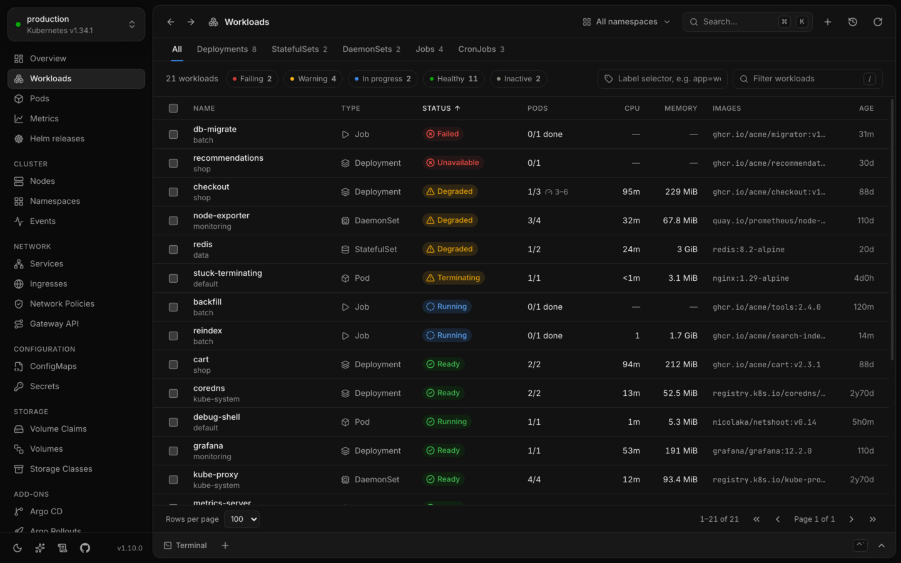     | 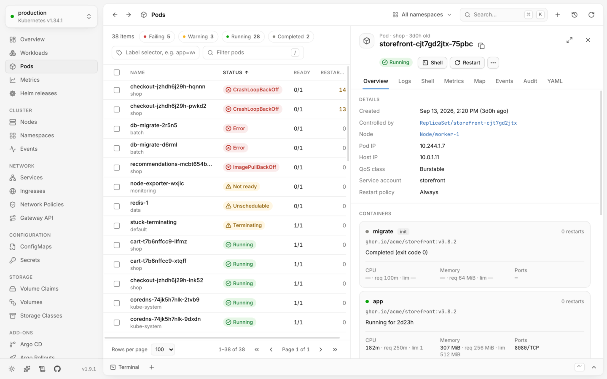                         |
| 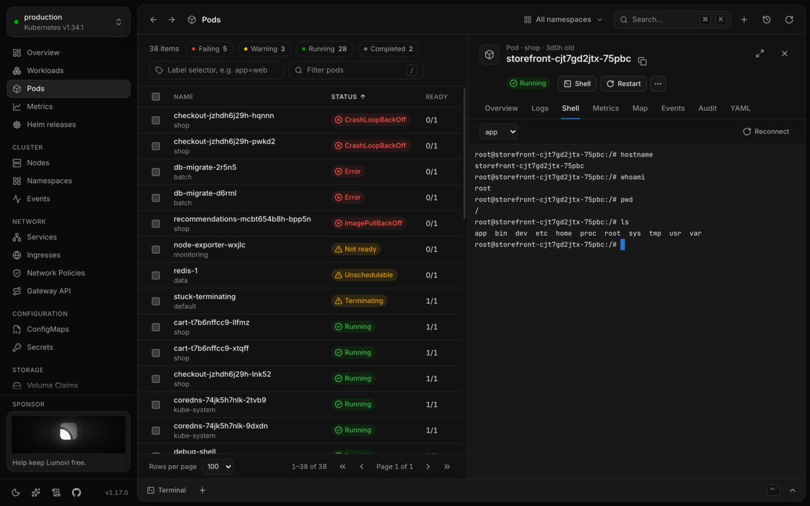                   | 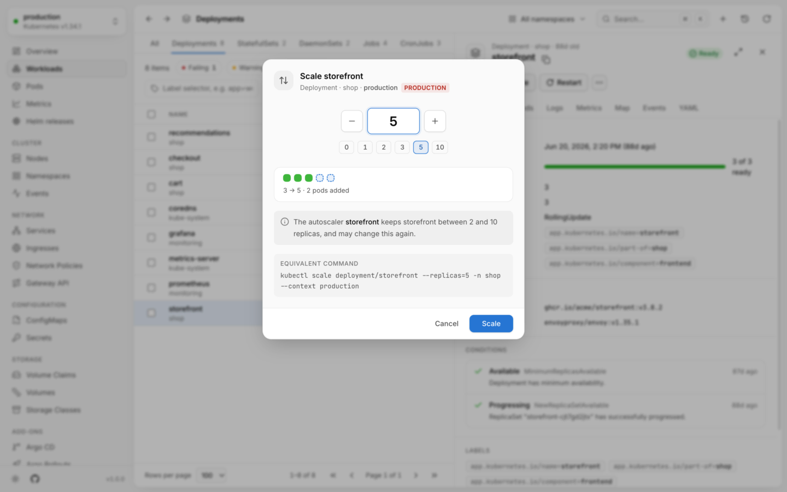                  |
| 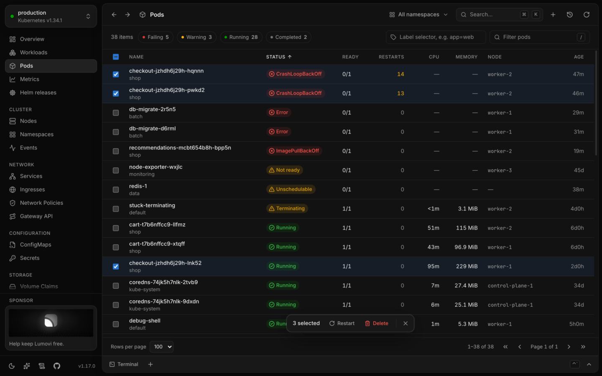               | 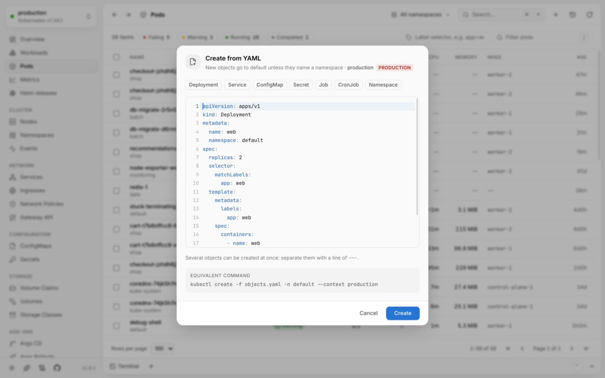                     |
| 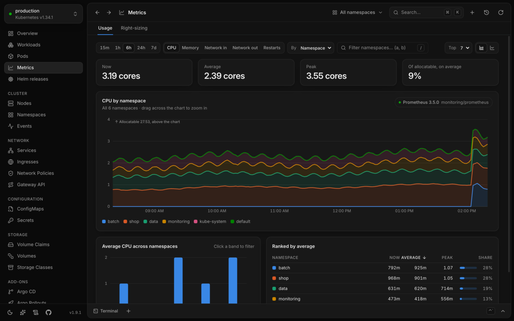                 | 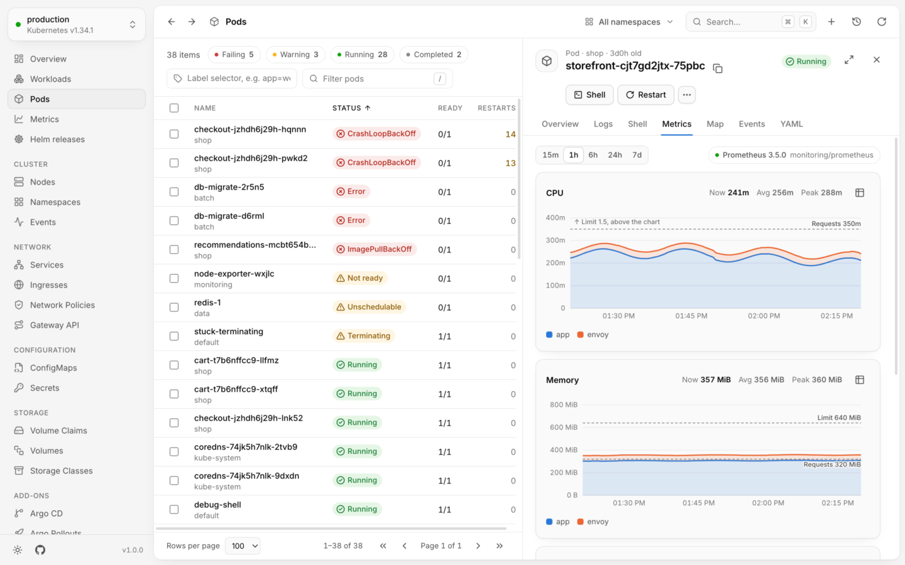           |
| 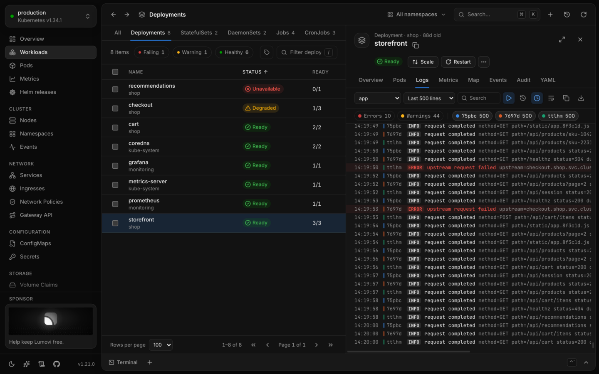                                |              |
| 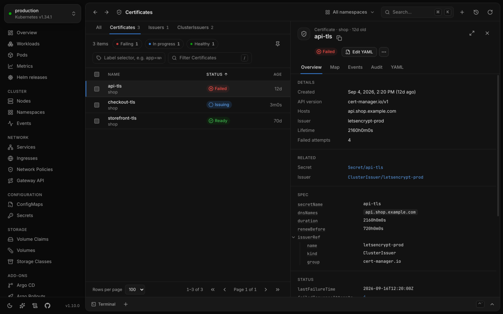        | 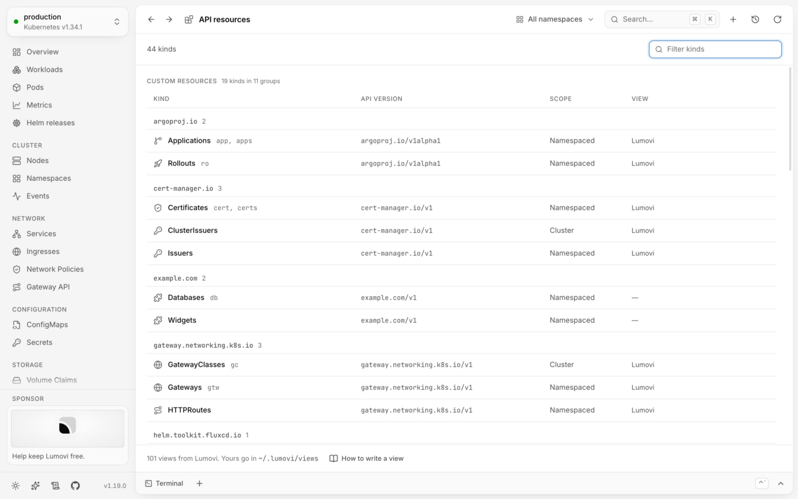 |
| 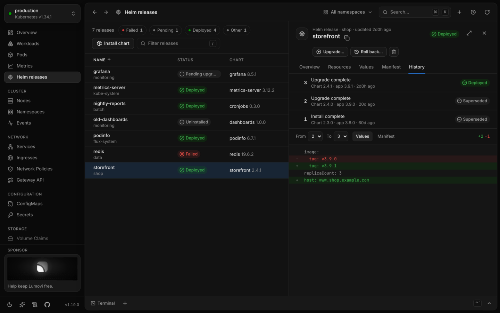            | 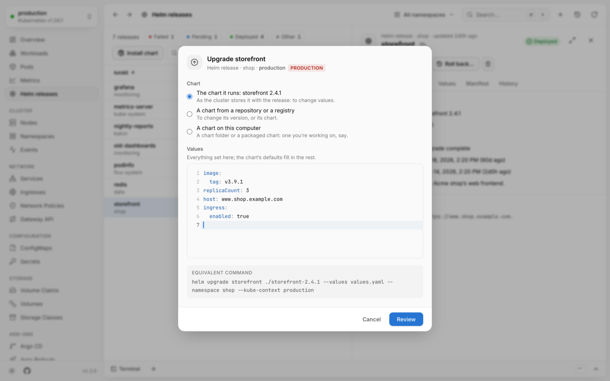       |
| 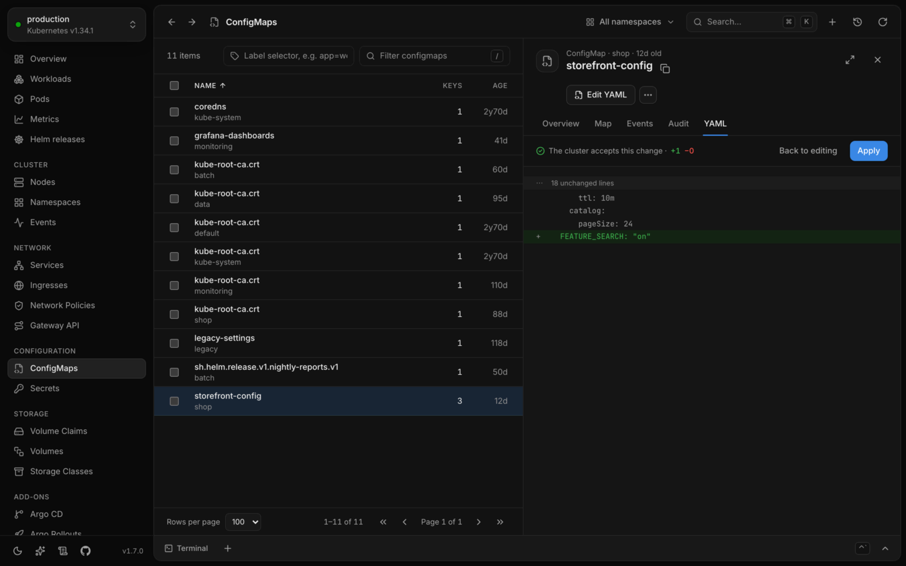 | 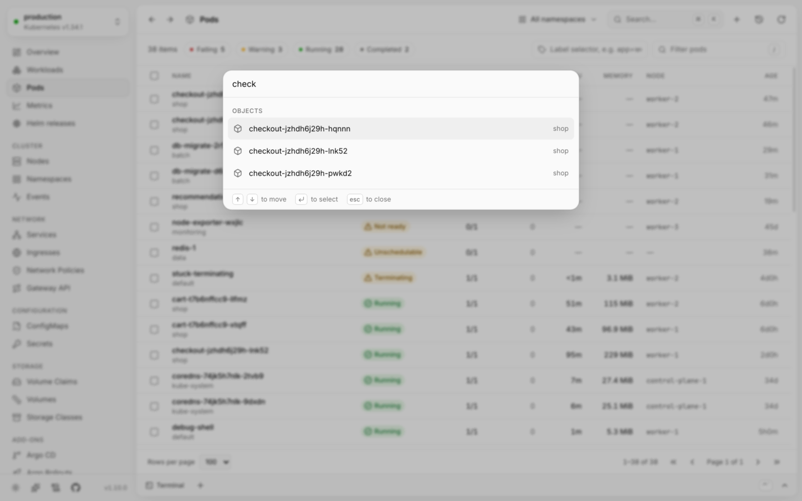         |

More, light and dark: [docs/screenshots](docs/screenshots).

## Getting started

### Desktop app

Download the installer for your platform from the
[latest release](https://github.com/KubeStacks/KubeStacks/releases/latest):

| Platform                      | Files                       |
| ----------------------------- | --------------------------- |
| macOS (Apple silicon & Intel) | `.dmg`, `.zip`              |
| Windows (x64 & arm64)         | `.exe` installer            |
| Linux (x64 & arm64)           | `.AppImage`, `.deb`, `.rpm` |

Open it and pick a cluster: KubeStacks reads them from the same place `kubectl` does
(`KUBECONFIG`, or `~/.kube/config`), credential plugins included. It keeps itself up to date:
a new version downloads in the background and installs when you restart the app.

> The macOS app is signed and notarized by Apple. Windows builds aren't code-signed yet: if
> Windows says it protected your PC, choose **More info → Run anyway**.

To build it yourself: `npm ci && npm run dist` (Node.js 24 or later) puts the installers for
your platform in `release/`. More in
[Get started on the desktop](https://docs.kubestacks.com/get-started/desktop).

### In your cluster

Install the Helm chart, then open KubeStacks through a port forward:

```sh
helm install kubestacks oci://ghcr.io/kubestacks/charts/kubestacks \
  --namespace kubestacks --create-namespace
kubectl port-forward --namespace kubestacks service/kubestacks 8080:80
```

Open <http://localhost:8080> and sign in with a token the cluster accepts. KubeStacks sends
your requests with it, so its permissions apply: a service account's, for example, valid for
an hour:

```sh
kubectl create token NAME --namespace NAMESPACE
```

For your team, give it an address of its own with the chart's ingress, and sign people in
with your identity provider:

```yaml
url: https://kubestacks.example.com
ingress:
  enabled: true
  hosts: [kubestacks.example.com]
auth:
  mode: oidc
  oidc:
    issuer: https://login.example.com
    clientId: kubestacks
    existingSecret: kubestacks-oidc # the client's secret, under client-secret
```

The image, `ghcr.io/kubestacks/kubestacks` (`linux/amd64` and `linux/arm64`), runs as a
non-root user without a shell, and also runs
[outside Kubernetes](https://docs.kubestacks.com/server/docker) against a kubeconfig. See
[KubeStacks in your cluster](https://docs.kubestacks.com/server/overview) for single sign-on
and authenticating proxies, ingress, security and every setting.

## Documentation

The documentation is at **[docs.kubestacks.com](https://docs.kubestacks.com)**:

| Guide                                                                     | What it covers                                                           |
| ------------------------------------------------------------------------- | ------------------------------------------------------------------------ |
| [Get started](https://docs.kubestacks.com/get-started/desktop)            | Installing the desktop app or KubeStacks in your cluster, and a tour     |
| [Using KubeStacks](https://docs.kubestacks.com/explore/overview)          | Finding your way, changing things safely, logs, shells, metrics and Helm |
| [Custom resources](https://docs.kubestacks.com/custom-resources/overview) | The views KubeStacks comes with, and writing your own                    |
| [In your cluster](https://docs.kubestacks.com/server/overview)            | Installing with Helm, signing in, security and configuration             |
| [Reference](https://docs.kubestacks.com/reference/keyboard-shortcuts)     | Shortcuts, settings, the view format, troubleshooting and FAQ            |

In this repository: [Development](docs/development.md) (building, architecture and testing),
and the [Changelog](CHANGELOG.md).

## Security and privacy

- **Your permissions, nothing more.** KubeStacks asks the cluster what you may do before
  offering it. In a cluster, everyone signs in and works with their own RBAC, the browser
  keeps nothing but a session cookie, and KubeStacks never acts as Kubernetes' own users or
  groups.
- **No telemetry, no accounts.** The desktop app connects only to your clusters (and through
  them to Prometheus), to [Artifact Hub](https://artifacthub.io) when you search it for
  charts, and to GitHub to look for new versions, which you can turn off.
- **Verifiable releases.** Every installer, the image and the chart carry a signed build
  provenance attestation (`gh attestation verify <file> --repo KubeStacks/KubeStacks`), and
  each release lists its installers' SHA-256 checksums.
- **Reporting a vulnerability.** See [SECURITY.md](SECURITY.md).

## Requirements

- **Kubernetes** 1.25 or later. Fields are explained from the cluster's OpenAPI schema from
  1.27, and signing in to KubeStacks in a cluster with a token needs 1.28.
- **Desktop:** macOS 12 or later, Windows 10 or later, or a recent 64-bit Linux. `kubectl`
  isn't needed, and [Helm](https://helm.sh) is only needed to change Helm releases.
- **In a cluster:** Helm 3.8 or later to install the chart, on `linux/amd64` or
  `linux/arm64` nodes. The image includes everything else.

## Contributing

Contributions are welcome. Please read [CONTRIBUTING.md](CONTRIBUTING.md) first, and
[docs/development.md](docs/development.md) to build and test KubeStacks.

A good first contribution is support for a tool you run: an add-on and views, written as YAML
and checked against the tool's CRDs, with no code to write. See
[Adding a tool](CONTRIBUTING.md#adding-a-tool).

## Sponsoring

KubeStacks is free and open source, made in spare time. If it saves you time, you can
[sponsor its development](https://github.com/sponsors/kotapeter) on GitHub; the app has a
link in its **Help** menu too.

## License

[Apache License 2.0](LICENSE)
